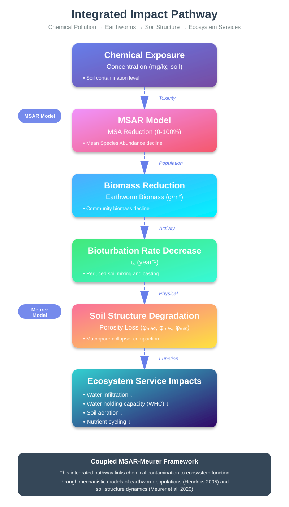

# This is a project on assessing impact of several chemical pollutant groups on ecosystem services
The main challange is to quantify how effect of pollutant on soil biota can be translated to soil functions and ecosystem services.
## Modelling impact of chemical pollution on soil functions
### ***Soifu*** collects different models for assessing imapct of pollutants on soil functions
These models should inlcude biological elements as receptors of chemical pollution so the modelled soil function can be related to a change in biological endpoint.
1) Effect of change in plant root and earthworm biomass on soil porosity
2) Change in biological endpoints will be modelled for each of the pollutant group
## Establishing a link between soil functions
## Linking affected soil functions to ecosystem services

